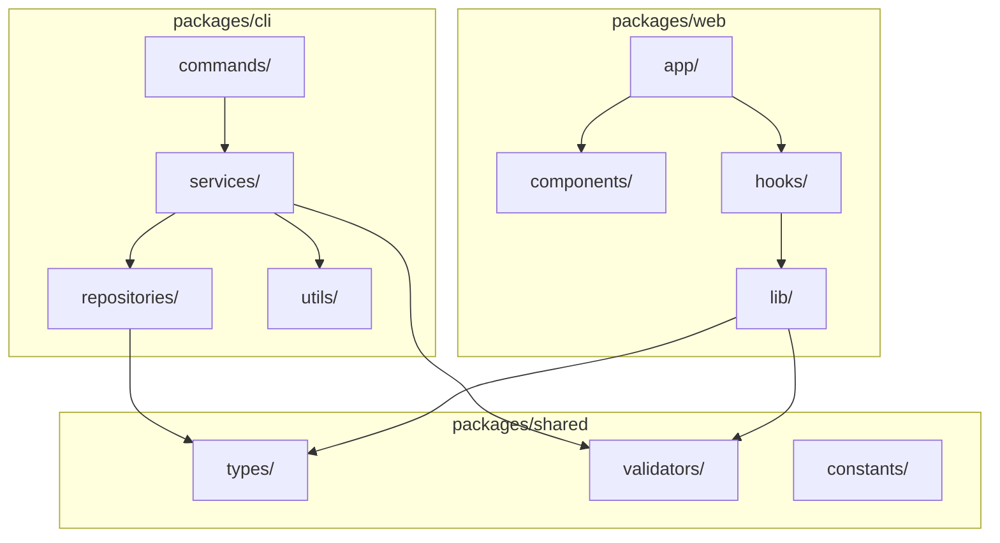

# Structure Diagram

## Monorepo全体構成



## packages/cli/ 詳細構成

```
packages/cli/
├── src/
│   ├── index.ts                    # エントリーポイント
│   ├── commands/                   # CLIコマンド定義
│   │   ├── init.ts                 # reqord init
│   │   ├── context/                # reqord context *
│   │   │   ├── init.ts
│   │   │   ├── show.ts
│   │   │   └── update.ts
│   │   ├── req/                    # reqord req *
│   │   │   ├── create.ts
│   │   │   ├── list.ts
│   │   │   ├── show.ts
│   │   │   ├── update.ts
│   │   │   ├── delete.ts
│   │   │   ├── approve.ts
│   │   │   ├── draft.ts
│   │   │   ├── history.ts
│   │   │   ├── implement.ts
│   │   │   └── validate.ts
│   │   ├── spec/                   # reqord spec *
│   │   │   ├── create.ts
│   │   │   ├── list.ts
│   │   │   ├── show.ts
│   │   │   ├── update.ts
│   │   │   ├── design.ts
│   │   │   ├── approve.ts
│   │   │   ├── draft.ts
│   │   │   ├── history.ts
│   │   │   ├── implement.ts
│   │   │   ├── coverage.ts
│   │   │   └── validate.ts
│   │   ├── task/                   # reqord task *
│   │   │   ├── create.ts
│   │   │   ├── fetch.ts
│   │   │   ├── sync.ts
│   │   │   └── validate.ts
│   │   ├── feedback/               # reqord feedback *
│   │   │   ├── create.ts
│   │   │   ├── list.ts
│   │   │   ├── show.ts
│   │   │   ├── close.ts
│   │   │   ├── link.ts
│   │   │   ├── unlink.ts
│   │   │   ├── resolve.ts
│   │   │   └── sync.ts
│   │   ├── impact/                 # reqord impact *
│   │   │   ├── analyze.ts
│   │   │   └── notify.ts
│   │   ├── validate/               # reqord validate *
│   │   │   └── impl.ts
│   │   ├── version/                # reqord version *
│   │   │   └── version.ts
│   │   ├── status.ts              # reqord status
│   │   └── ui.ts                  # 共通UI
│   │
│   ├── services/                   # ビジネスロジック
│   │   ├── requirement-service.ts
│   │   ├── specification-service.ts
│   │   ├── issue-service.ts
│   │   ├── issue-fetch-service.ts
│   │   ├── issue-sync-service.ts
│   │   ├── context-service.ts
│   │   ├── approval-service.ts
│   │   ├── impact-service.ts
│   │   ├── feedback-service.ts
│   │   ├── feedback-sync-service.ts
│   │   ├── status-service.ts
│   │   ├── validation-service.ts
│   │   ├── spec-validation-service.ts
│   │   ├── impl-validation-service.ts
│   │   ├── coverage-service.ts
│   │   ├── version-service.ts
│   │   ├── init-service.ts
│   │   ├── migration-service.ts
│   │   ├── draft-reversion-service.ts
│   │   ├── requirement-approval-handler.ts
│   │   ├── specification-approval-handler.ts
│   │   ├── spec-approval-helpers.ts
│   │   ├── github-client.ts
│   │   └── reqord-comment.ts
│   │
│   ├── repositories/               # データアクセス層
│   │   ├── requirement.ts
│   │   ├── specification.ts
│   │   ├── project-context.ts
│   │   ├── feedback.ts
│   │   ├── file-system.ts
│   │   ├── git.ts
│   │   └── github.ts
│   │
│   └── utils/                      # ユーティリティ
│       ├── id-generator.ts         # ID採番 (req-000001, spec-000001)
│       ├── display.ts              # 表示ユーティリティ
│       ├── error-handler.ts        # エラーハンドリング
│       ├── errors.ts               # エラー定義
│       ├── progress-calculator.ts  # 進捗計算
│       ├── spec-tag-parser.ts      # スペックタグパーサー
│       └── templates.ts            # テンプレート
│
├── package.json
├── tsconfig.json
└── vitest.config.ts
```

## packages/shared/ 詳細構成

```
packages/shared/
├── src/
│   ├── index.ts                    # 公開API
│   ├── types/                      # 型定義
│   │   ├── context.ts              # ProjectContext
│   │   ├── requirement.ts          # Requirement
│   │   ├── specification.ts        # Specification
│   │   ├── issue.ts                # Issue metadata
│   │   └── common.ts              # 共通型 (Status, Priority等)
│   │
│   ├── validators/                 # バリデーション
│   │   ├── context-validator.ts
│   │   ├── requirement-validator.ts
│   │   ├── specification-validator.ts
│   │   └── ears-validator.ts       # EARS形式検証
│   │
│   └── constants/                  # 定数
│       ├── statuses.ts             # ステータス定義
│       ├── priorities.ts           # 優先度定義
│       └── templates.ts            # テンプレートパス
│
├── package.json
└── tsconfig.json
```

## packages/web/ 詳細構成

```
packages/web/
├── src/
│   ├── app/                        # Next.js App Router
│   │   ├── layout.tsx
│   │   ├── page.tsx                # Dashboard
│   │   ├── requirements/
│   │   │   ├── page.tsx            # 要件一覧
│   │   │   └── [id]/
│   │   │       └── page.tsx        # 要件詳細
│   │   ├── specifications/
│   │   │   ├── page.tsx            # 仕様一覧
│   │   │   └── [id]/
│   │   │       └── page.tsx        # 仕様詳細
│   │   └── settings/
│   │       └── page.tsx            # 設定
│   │
│   ├── components/                 # UIコンポーネント
│   │   ├── ui/                     # 基本UIパーツ
│   │   ├── requirement/            # 要件関連
│   │   ├── specification/          # 仕様関連
│   │   ├── graph/                  # 依存関係グラフ
│   │   └── chart/                  # Ganttチャート
│   │
│   ├── hooks/                      # カスタムフック
│   │   ├── use-requirements.ts
│   │   ├── use-specifications.ts
│   │   └── use-context.ts
│   │
│   └── lib/                        # ライブラリ連携
│       ├── file-reader.ts          # .reqord/ 読み取り
│       ├── mermaid-renderer.ts     # Mermaid描画
│       └── markdown-renderer.ts    # Markdownレンダリング
│
├── package.json
├── tsconfig.json
├── next.config.ts
└── tailwind.config.ts
```
