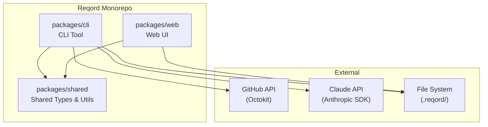
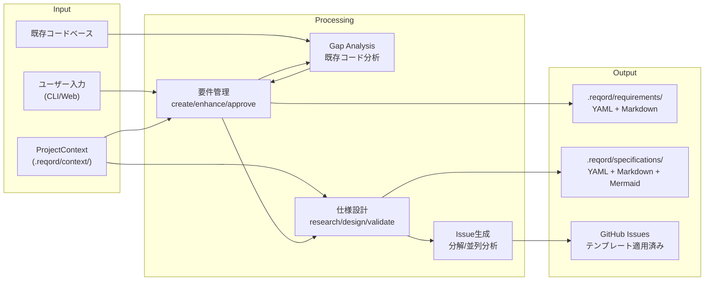

# Technical Narrative

## Monorepo構成

## データフロー

## 設計パターン

### Repository Pattern

データアクセス層の抽象化。ファイルシステム操作（YAML/Markdown読み書き）をRepositoryで抽象化し、ビジネスロジックからI/Oを分離する。

- `RequirementRepository` - 要件のCRUD（YAML + Markdownの統合管理）
- `SpecificationRepository` - 仕様のCRUD
- `ContextRepository` - ProjectContextの読み書き

### Command Pattern

CLIコマンドの構造化。Commander.jsと組み合わせ、各コマンドをクラスとして実装。入力バリデーション、実行、出力フォーマットを分離。

### Factory Pattern

オブジェクト生成の統一。要件・仕様・Issueの新規作成時にID採番、初期値設定、テンプレート適用をFactoryに集約。

### Observer Pattern

変更の伝播管理。要件変更時の影響範囲分析（仕様→Issue連鎖）をObserverパターンで実装。依存先への自動通知。
