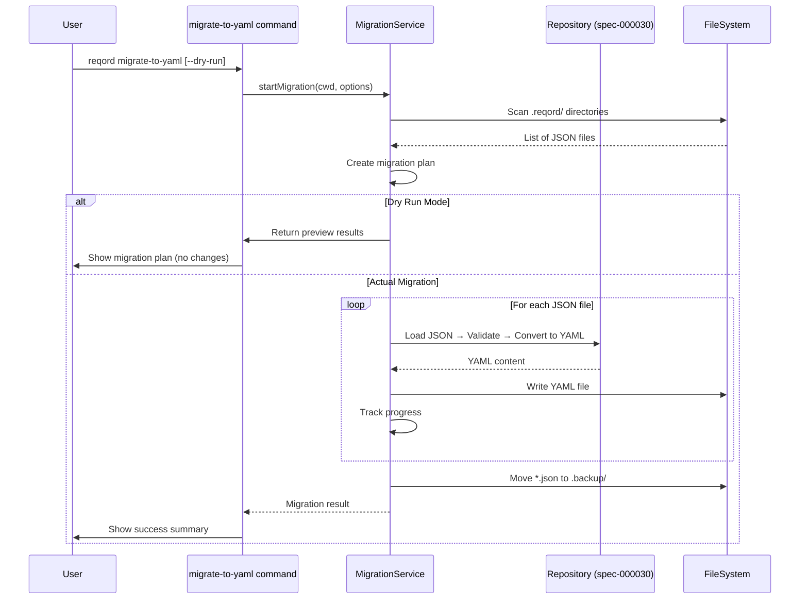

# migrate-to-yamlコマンド実装 - 技術設計書

## 1. 設計概要

### 1.1 目的

既存のJSON形式で保存されている要件・仕様・ProjectContext・Feedbackを一括してYAML形式に変換するCLIコマンドを実装する。spec-000030で実装されたYAML変換レイヤーを活用し、ユーザーが簡単かつ安全にデータ形式を移行できるようにする。

### 1.2 スコープ

**対象ファイル:**
- `.reqord/requirements/*.json` (27ファイル想定)
- `.reqord/specifications/*.json` (31ファイル想定)
- `.reqord/context/product.json`
- `.reqord/context/technical.json`
- `.reqord/context/structure.json`
- `.reqord/context/context.json`
- `.reqord/feedback/index.json`

**対象外:**
- Markdownファイル (`description.md`, `design.md`) は変換対象外
- `.reqord/settings/`, `.reqord/assets/` ディレクトリは対象外

### 1.3 技術スタック

- **CLIフレームワーク**: Commander.js (既存パターン踏襲)
- **YAML変換**: spec-000030で実装されるYAML変換レイヤー (`js-yaml`)
- **進捗表示**: `chalk` (カラー出力) + プログレスカウンター（自前実装）
- **エラーハンドリング**: 既存の `AppError` + `handleError` 統一パターン

## 2. アーキテクチャ

### 2.1 レイヤー構成

```
┌─────────────────────────────────────────┐
│  CLI Command Layer (migrate-to-yaml.ts) │ コマンド定義・オプション解析・UI
├─────────────────────────────────────────┤
│  Service Layer (migration-service.ts)   │ 移行ロジック・進捗管理・ロールバック
├─────────────────────────────────────────┤
│  Repository Layer (spec-000030)         │ YAML変換・ファイルI/O
├─────────────────────────────────────────┤
│  Zod Schema Layer (@reqord/shared)      │ バリデーション
└─────────────────────────────────────────┘
```

### 2.2 処理フロー



## 3. コンポーネント設計

### 3.1 CLIコマンド (`packages/cli/src/commands/migrate-to-yaml.ts`)

```typescript
import { Command } from "commander";
import chalk from "chalk";
import { migrateToYaml } from "../services/migration-service.js";
import { handleError } from "../utils/error-handler.js";

export const migrateToYamlCommand = new Command("migrate-to-yaml")
  .description("Migrate all JSON files to YAML format in .reqord/")
  .option("--dry-run", "Preview migration without making changes")
  .action(async (options: { dryRun?: boolean }) => {
    const cwd = process.cwd();

    try {
      const result = await migrateToYaml(cwd, {
        dryRun: options.dryRun ?? false,
      });

      if (options.dryRun) {
        console.log(chalk.yellow("プレビューモード（実際の変換は行いません）"));
        console.log("");
        console.log(chalk.bold("変換対象ファイル:"));
        result.plan.forEach((item) => {
          console.log(`  ${item.source} → ${item.destination}`);
        });
        console.log("");
        console.log(chalk.gray(`合計: ${result.plan.length}ファイル`));
        return;
      }

      console.log(chalk.green("YAML移行が完了しました"));
      console.log(`  変換成功: ${result.success.length}ファイル`);
      if (result.errors.length > 0) {
        console.log(chalk.red(`  変換失敗: ${result.errors.length}ファイル`));
        result.errors.forEach((err) => {
          console.log(chalk.red(`    - ${err.file}: ${err.reason}`));
        });
      }
      console.log("");
      console.log(chalk.gray(`バックアップ: .reqord/.backup/ に移動済み`));
    } catch (error) {
      handleError(error);
    }
  });
```

### 3.2 Migrationサービス (`packages/cli/src/services/migration-service.ts`)

```typescript
import fs from "fs-extra";
import path from "path";
import { REQORD_DIR, REQUIREMENTS_DIR, SPECIFICATIONS_DIR } from "@reqord/shared";
import { AppError, ErrorCode } from "../utils/errors.js";

export interface MigrationOptions {
  dryRun: boolean;
}

export interface MigrationPlanItem {
  source: string; // JSON file path
  destination: string; // YAML file path
  type: "requirement" | "specification" | "context" | "feedback";
}

export interface MigrationResult {
  plan: MigrationPlanItem[];
  success: string[]; // Converted file paths
  errors: Array<{ file: string; reason: string }>;
}

export async function migrateToYaml(
  cwd: string,
  options: MigrationOptions
): Promise<MigrationResult> {
  const reqordPath = path.join(cwd, REQORD_DIR);

  // Check .reqord/ exists
  if (!await fs.pathExists(reqordPath)) {
    throw new AppError(
      ".reqord/ directory not found. Run 'reqord init' first.",
      ErrorCode.NOT_FOUND
    );
  }

  // Step 1: Create migration plan
  const plan = await createMigrationPlan(cwd);

  if (options.dryRun) {
    return { plan, success: [], errors: [] };
  }

  // Step 2: Execute migration
  const backupDir = path.join(reqordPath, ".backup", new Date().toISOString().split("T")[0]);
  await fs.ensureDir(backupDir);

  const success: string[] = [];
  const errors: Array<{ file: string; reason: string }> = [];

  for (const item of plan) {
    try {
      // Read JSON
      const jsonContent = await fs.readJSON(item.source);

      // Validate with Zod (depends on type)
      // Convert to YAML using spec-000030 layer
      const yamlContent = convertToYaml(jsonContent, item.type);

      // Write YAML
      await fs.writeFile(item.destination, yamlContent, "utf-8");

      // Move JSON to backup
      const backupPath = path.join(backupDir, path.basename(item.source));
      await fs.move(item.source, backupPath);

      success.push(item.destination);
    } catch (error) {
      errors.push({
        file: item.source,
        reason: error instanceof Error ? error.message : String(error),
      });
    }
  }

  // Rollback if critical errors (>10% failure rate)
  if (errors.length > 0 && errors.length / plan.length > 0.1) {
    throw new AppError(
      `Migration failed with ${errors.length} errors. Run with --dry-run to preview.`,
      ErrorCode.MIGRATION_FAILED
    );
  }

  return { plan, success, errors };
}

async function createMigrationPlan(cwd: string): Promise<MigrationPlanItem[]> {
  const plan: MigrationPlanItem[] = [];
  const reqordPath = path.join(cwd, REQORD_DIR);

  // Requirements
  const requirementsPath = path.join(reqordPath, REQUIREMENTS_DIR);
  if (await fs.pathExists(requirementsPath)) {
    const reqFiles = await fs.readdir(requirementsPath);
    for (const file of reqFiles.filter((f) => f.endsWith(".json") && f.startsWith("req-"))) {
      plan.push({
        source: path.join(requirementsPath, file),
        destination: path.join(requirementsPath, file.replace(".json", ".yaml")),
        type: "requirement",
      });
    }
  }

  // Specifications
  const specificationsPath = path.join(reqordPath, SPECIFICATIONS_DIR);
  if (await fs.pathExists(specificationsPath)) {
    const specFiles = await fs.readdir(specificationsPath);
    for (const file of specFiles.filter((f) => f.endsWith(".json") && f.startsWith("spec-"))) {
      plan.push({
        source: path.join(specificationsPath, file),
        destination: path.join(specificationsPath, file.replace(".json", ".yaml")),
        type: "specification",
      });
    }
  }

  // Context files
  const contextPath = path.join(reqordPath, "context");
  const contextFiles = ["product.json", "technical.json", "structure.json", "context.json"];
  for (const file of contextFiles) {
    const filePath = path.join(contextPath, file);
    if (await fs.pathExists(filePath)) {
      plan.push({
        source: filePath,
        destination: filePath.replace(".json", ".yaml"),
        type: "context",
      });
    }
  }

  // Feedback
  const feedbackIndexPath = path.join(reqordPath, "feedback", "index.json");
  if (await fs.pathExists(feedbackIndexPath)) {
    plan.push({
      source: feedbackIndexPath,
      destination: feedbackIndexPath.replace(".json", ".yaml"),
      type: "feedback",
    });
  }

  return plan;
}

function convertToYaml(data: unknown, type: MigrationPlanItem["type"]): string {
  // This function will use spec-000030's YAML conversion layer
  // Placeholder implementation
  const yaml = require("js-yaml");
  return yaml.dump(data, {
    indent: 2,
    lineWidth: 100,
    noRefs: true,
    sortKeys: false,
  });
}
```

### 3.3 エラー定義拡張 (`packages/cli/src/utils/errors.ts`)

```typescript
export enum ErrorCode {
  // ... existing codes
  MIGRATION_FAILED = "MIGRATION_FAILED",
}
```

## 4. データフロー

### 4.1 Dry Runモード

```
User Input: reqord migrate-to-yaml --dry-run
    ↓
Scan .reqord/ directories (requirements, specifications, context, feedback)
    ↓
Create migration plan (source → destination mapping)
    ↓
Display plan to console (no file changes)
```

### 4.2 実際の移行モード

```
User Input: reqord migrate-to-yaml
    ↓
Create migration plan
    ↓
Create backup directory (.reqord/.backup/YYYY-MM-DD/)
    ↓
For each file:
  - Read JSON
  - Validate with Zod schema
  - Convert to YAML (spec-000030)
  - Write YAML
  - Move JSON to backup
    ↓
Check error rate (>10% → rollback & throw error)
    ↓
Display summary (success count, error count, backup location)
```

### 4.3 エラーハンドリング

| エラー種別 | 対処方法 |
|-----------|---------|
| `.reqord/` が存在しない | `AppError(NOT_FOUND)` をスロー |
| JSON読み込みエラー | エラーリストに追加、次のファイルへ継続 |
| Zodバリデーションエラー | エラーリストに追加、次のファイルへ継続 |
| YAML書き込みエラー | エラーリストに追加、次のファイルへ継続 |
| エラー率 >10% | `AppError(MIGRATION_FAILED)` をスロー |

## 5. テスト方針

### 5.1 ユニットテスト (`packages/cli/src/services/migration-service.test.ts`)

- `createMigrationPlan()`: 正しいファイルリストを生成
- `convertToYaml()`: JSON → YAML変換の正確性
- エラーハンドリング: 不正なJSONファイルの処理

### 5.2 統合テスト (`packages/cli/src/commands/migrate-to-yaml.test.ts`)

- Dry Runモード: ファイルが変更されないことを確認
- 実際の移行: JSONファイルがYAMLに変換され、バックアップが作成される
- ロールバック: エラー率が高い場合に移行が中断される

### 5.3 E2Eテスト

```bash
# 1. テスト用プロジェクトを作成
reqord init
reqord req create "Test Requirement"

# 2. Dry Runで確認
reqord migrate-to-yaml --dry-run

# 3. 実際の移行
reqord migrate-to-yaml

# 4. YAMLファイルが正常に読み込めることを確認
reqord req list
```

### 5.4 テストデータ

- 正常なJSON: 27 requirements, 31 specifications
- 不正なJSON: 構文エラー、スキーマ違反
- エッジケース: 空配列、特殊文字、日本語文字列

## 6. 技術的決定事項

### 6.1 YAML変換レイヤーの再利用

spec-000030で実装されるYAML変換レイヤー（Repository層）を直接使用する。`migration-service.ts`内で`js-yaml`を直接呼び出す実装は暫定的なもので、spec-000030完了後にRepository層のAPIに置き換える。

### 6.2 バックアップ戦略

- バックアップディレクトリ: `.reqord/.backup/YYYY-MM-DD/`
- 日付ごとにディレクトリを分けることで、同日の複数回実行時も上書きされない（タイムスタンプ追加も検討）
- `.backup/` ディレクトリは `.gitignore` に追加することを推奨

### 6.3 進捗表示の簡略化

当初検討していた `inquirer.js` のプログレスバーは依存関係に含まれていないため、シンプルなカウンター表示（`chalk`を使用）を採用:

```
変換中... (15/58)
変換中... (30/58)
変換中... (58/58)
完了！
```

### 6.4 並行処理の見送り

初期実装では順次処理を採用。ファイル数が50-100程度であれば、ファイルI/Oのボトルネックは数秒程度。並行処理による複雑性の増加を避ける。将来的にファイル数が1000件を超える場合は `Promise.all()` を用いた並行処理を検討。

### 6.5 ロールバック条件

エラー率が10%を超えた場合、移行を中断し `MIGRATION_FAILED` エラーをスロー。部分的に変換されたファイルは残るが、バックアップから手動で復旧可能。完全自動ロールバックは実装コストとリスクを考慮し見送り。

### 6.6 Zodスキーマのバリデーション

YAML変換前にZodスキーマでバリデーションを実行し、不正なJSONファイルを事前に検出する。これにより、変換後のYAMLファイルがすべて有効であることを保証する。

---

**設計完了日**: 2026-02-11
**前提条件**: spec-000030（YAML変換レイヤー）が実装済みであること
**推定工数**: 8-12時間（medium complexity）
