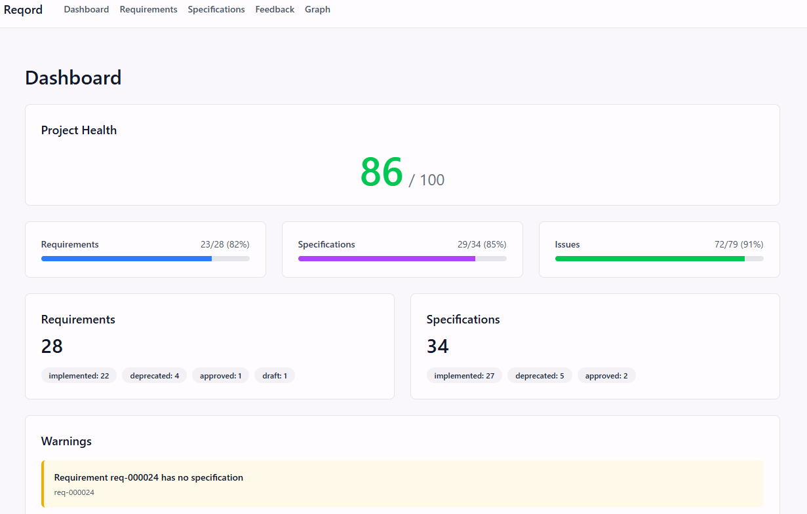
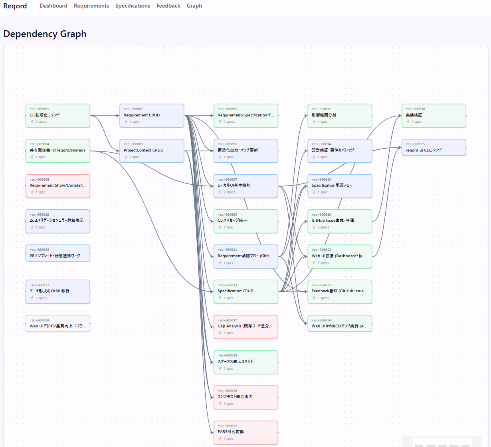

<p align="center">
  
</p>

<h1 align="center">Reqord</h1>

> [日本語](./README.ja.md)

**Structured context for the AI era, version-controlled alongside your code.**

[](https://www.npmjs.com/package/@reqord/cli)
[](./LICENSE)
[](./packages)
[](https://www.typescriptlang.org/)

---

Reqord stores requirements as structured data (YAML + Markdown) inside your Git repository, giving every requirement a clear lifecycle from draft to implementation. No SaaS, no backend -- just `git clone` and your entire requirements history is there, version-controlled alongside your code, ready for humans and AI tools alike.

<p align="center">
  
</p>

---

## Why Reqord?

Software teams lose track of requirements. The consequences compound over time:

- **Scattered requirements** -- decisions live in chat threads, meeting notes, and memory. Nothing is canonical.
- **Lost context** -- new team members and AI tools start every session without project background.
- **Spec drift** -- specifications written at project start are never updated. Implementation quietly diverges.
- **Broken traceability** -- no one can answer "why does this feature exist?" or "what breaks if we change it?"
- **AI gets bad inputs** -- unstructured text produces inconsistent AI output. Every session starts from scratch.

Reqord solves these by making requirements structured, versioned, and traceable -- stored right where your code lives.

## How It Works

Reqord enforces a 3-layer traceability model that connects intent to implementation:

```
Requirement (What)  -->  Specification (How)  -->  GitHub Issue (Tasks)
       ^                                                  |
       '------------------ Feedback Loop -----------------'
```

| Layer             | Purpose                       | Example                                  |
| ----------------- | ----------------------------- | ---------------------------------------- |
| **Requirement**   | What to build                 | "Users can log in with email"            |
| **Specification** | How to build it               | "OAuth2 + JWT, sessions stored in Redis" |
| **GitHub Issue**  | Concrete implementation tasks | "Implement POST /auth/login endpoint"    |

Each layer links to the others. When a requirement changes, you can trace the impact through specifications to issues. When implementation feedback surfaces, it flows back to update requirements.

**Lifecycle:**

```
draft --> pending_approval --> approved --> implemented --> deprecated
```

Requirements move through a defined lifecycle with PR-based approval gates, so nothing gets lost and nothing ships without review.

## Quick Start

### Install

```bash
npm install -g @reqord/cli

# Optional: install the web dashboard
npm install -g @reqord/web
```

### Claude Code Plugin

Reqord provides a Claude Code plugin for AI-assisted requirements workflow (design, TDD implementation, review, Git operations).

```bash
# Add the marketplace
/plugin marketplace add kicchann/reqord

# Install the plugin
/plugin install reqord@reqord-plugins
```

### Initialize a project

```bash
cd /path/to/your/project

# Initialize the .reqord/ directory structure
reqord init

# Set up project context
reqord context init
```

### Create your first requirement

```bash
# Create a requirement (supports user-story, ears, and free-form formats)
reqord req create

# List all requirements
reqord req list

# Validate requirement quality with SMART scoring
reqord req validate req-000001
```

See the [Getting Started guide](./docs/getting-started.md) for the full walkthrough.

<details>
<summary>Development setup (building from source)</summary>

**Prerequisites:** Node.js 20+, pnpm 10+, Git

```bash
git clone https://github.com/kicchann/reqord.git
cd reqord
pnpm install
pnpm build
cd packages/cli && pnpm link --global
```

</details>

## Key Features

### Hybrid Storage (YAML + Markdown)

Requirements are stored as YAML metadata (status, priority, dependencies, version history) paired with Markdown content (descriptions, success criteria, use cases). Machine-readable structure with human-readable documentation.

### SMART Validation

Built-in quality scoring based on the SMART framework (Specific, Measurable, Achievable, Relevant, Time-bound). Run `reqord req validate` to get an objective quality score and actionable improvement suggestions for any requirement.

### PR-Based Approval Workflow

Requirements follow the same review process as code. Submit a requirement for approval, and it creates a pull request. CODEOWNERS review and merge to approve. The entire approval history is tracked with version, commit hash, reviewer, and timestamp.

### Requirement Formats

Supports industry-standard formats out of the box:

- **EARS** (Easy Approach to Requirements Syntax) -- structured trigger/condition/action format
- **User Story** -- "As a [role], I want [feature], so that [benefit]"
- **Free-form** -- flexible format for early-stage requirements

### Web Dashboard

Launch the built-in web dashboard to visualize project health, dependency graphs, and requirement details:

```bash
reqord ui
```

<p align="center">
  
</p>

### AI Integration via ProjectContext

The `.reqord/context/` directory stores structured project knowledge that AI tools can consume directly:

| File             | Purpose                                                      |
| ---------------- | ------------------------------------------------------------ |
| `product.yaml`   | Vision, target users, core features, out-of-scope            |
| `technical.yaml` | Tech stack, architecture, design patterns                    |
| `structure.yaml` | Naming conventions, directory structure, import rules        |
| `domain/*.md`    | Domain-specific knowledge (security policies, API standards) |

This context persists across AI sessions, eliminating the "explain the project from scratch every time" problem. Works with Claude Code, Cursor, Windsurf, Codex, and any tool that can read files.

### Feedback Loop

Track feedback from GitHub Issues back to requirements and specifications:

```bash
reqord feedback sync    # Sync feedback from GitHub Issues
reqord feedback list    # View feedback items
reqord feedback link feedback-001  # Link feedback to a requirement
```

When implementation reveals that a requirement needs updating, the feedback loop ensures that knowledge flows back upstream rather than getting lost in issue comments.

## Comparison

How Reqord compares to existing tools for managing what to build:

| Capability             | Reqord                               | Jira              | Linear            | Notion             | GitHub Projects    |
| ---------------------- | ------------------------------------ | ----------------- | ----------------- | ------------------ | ------------------ |
| **Git-native**         | Yes -- lives in your repo            | No                | No                | No                 | Partial            |
| **Offline-first**      | Yes -- no server needed              | No                | No                | No                 | No                 |
| **AI-ready structure** | YAML + Markdown, typed schemas       | Unstructured text | Unstructured text | Unstructured text  | Unstructured text  |
| **Traceability**       | Enforced (Req -> Spec -> Issue)      | Manual linking    | Manual linking    | Manual linking     | Manual linking     |
| **Approval workflow**  | PR-based with CODEOWNERS             | Built-in workflow | Built-in workflow | No formal approval | No formal approval |
| **Version control**    | Full Git history + semantic versions | Limited history   | Limited history   | Page history       | No versioning      |
| **Quality validation** | SMART scoring built-in               | No                | No                | No                 | No                 |
| **Cost**               | Free (AGPL-3.0)                      | Paid              | Paid              | Freemium           | Free (limited)     |

**Reqord is not a replacement for project management tools.** It focuses specifically on requirements lifecycle management and is designed to complement tools like Jira, Linear, or GitHub Projects.

## Architecture

Reqord is a monorepo with three packages:

- **[@reqord/shared](./packages/shared/)** -- Zod schemas, types, utilities (single source of truth)
- **[@reqord/cli](./packages/cli/)** -- CLI tool (Commander.js)
- **[@reqord/web](./packages/web/)** -- Web dashboard (Next.js 15 + React 19)

## Documentation

- **[Getting Started](./docs/getting-started.md)** -- installation and first steps
- **[Requirements Guide](./docs/guide-requirements.md)** -- how to write effective requirements
- **[CLI Reference](./docs/cli-reference.md)** -- all commands with implementation status
- **[About Reqord](./docs/about/index.md)** -- design philosophy, theory, and best practices

See [docs/README.md](./docs/README.md) for the full documentation index.

## Roadmap

Reqord is at v0.1.0 (pre-release). Current priorities for upcoming releases:

- **PR-based approval workflow** -- `reqord req approve` and `reqord spec approve` commands with GitHub PR integration
- **Impact analysis** -- trace how changes to one requirement affect specifications and issues
- **GitHub Issue generation** -- decompose specifications into implementation tasks automatically
- **Status dashboard** -- `reqord status` command for project-wide progress overview
- **Web UI enhancements** -- Gantt charts, richer dependency visualization, specification editing

See the [CLI Reference](./docs/cli-reference.md) for the full list of planned commands and their current implementation status.

## Contributing

Contributions are welcome. Please see [CONTRIBUTING.md](./CONTRIBUTING.md) for guidelines.

## License

[AGPL-3.0](./LICENSE)

Reqord is licensed under the GNU Affero General Public License v3.0. You can freely use, modify, and distribute Reqord for any purpose, including commercial use. If you run a modified version as a network service, you must make the source code available to users of that service.

