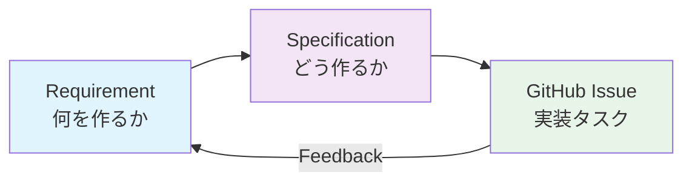

> **この文書のまとめ**: Reqordが何を達成するのか、誰のために作られたのか。機能概要とスコープの定義。

# Purpose — 何を達成するのか、誰のためか

## ビジョン

"考えたこと" から "実装可能なタスク" への変換を、構造的かつ追跡可能にする。

## ワークフロー全体像

Reqordの3層モデル:

| 層 | 役割 | 例 |
|---|---|---|
| **Requirement** | 何を作るか（What） | 「ユーザーがメールでログインできる」 |
| **Specification** | どう作るか（How） | 「OAuth2 + JWT、セッション管理はRedis」 |
| **GitHub Issue** | 実装タスク | 「POST /auth/login エンドポイント実装」 |

フィードバックループにより、実装後の知見が要件・仕様の更新に還流する。

## ターゲットユーザー

### 開発チーム（テックリード + 開発者）

**課題**: 品質の担保、設計判断のトレーサビリティ、チームの要件理解のばらつき

**Reqordが提供する価値**:
- PRベースの承認ワークフロー（CODEOWNERSレビュー）
- Requirement → Specification → Issue の追跡チェーン
- SMARTバリデーションによる要件品質の客観的評価
- 依存関係グラフで変更の影響範囲を可視化

### プロダクトオーナー

**課題**: 進捗の把握、要件の全体像の把握、機能間の依存関係の理解

**Reqordが提供する価値**:
- Web UIのダッシュボードで進捗を一覧
- 依存関係グラフで機能間の関係を視覚化
- ステータスライフサイクル（draft → approved → implemented）で状態を明確に

### AI駆動開発チーム

**課題**: AIへの指示が曖昧で出力品質が安定しない、セッション間でコンテキストが消失する

**Reqordが提供する追加価値**:
- 構造化された要件がAIへの明確な入力になる
- ProjectContext（product.md, technical.md, domain/*.md）で毎回のAIセッションに一貫した文脈を提供
- 人間がReqordを通じて「何が決まり、何が実装され、何が残っているか」を常に把握できる

## 中核機能の概要

### ProjectContext管理

プロジェクト全体のコンテキストを構造化して管理:
- `context.json` — プロジェクトメタデータ
- `product.md` — ビジョン、課題、ターゲットユーザー
- `technical.md` — 技術スタック、アーキテクチャ
- `structure.md` — 命名規則、ディレクトリ構造
- `domain/*.md` — ドメイン固有の知識

### 要件CRUD + SMARTバリデーション

- 要件の作成・一覧・更新・削除
- EARS / User Story / Free-form 形式をサポート
- SMART基準（Specific, Measurable, Achievable, Relevant, Time-bound）での品質スコアリング

### 仕様設計

- 要件に紐づく仕様（design.md）の作成・管理
- AI支援による技術設計の生成
- Mermaid図、コード例を含む詳細な仕様ドキュメント

### GitHub Issue生成

- 仕様から実装タスクへの分解
- 依存関係を反映した実行順序の定義
- 並列実行可能なタスクのグルーピング

### PRベース承認フロー

- `reqord req approve` でPRを作成、ステータスを pending_approval に変更
- CODEOWNERSによるレビュー
- PRマージでステータスが approved に確定

### フィードバック同期

- GitHub Issueのフィードバックを要件・仕様に還流
- flagシステムで「承認済みだがフィードバックあり」の状態を管理
- 段階的な構造化（まずIssueで議論 → 必要に応じてReqordに構造化）

### Web UI

- ダッシュボードでの進捗可視化
- 依存関係グラフ
- 要件・仕様の閲覧・編集

## スコープ

### IN（対象範囲）

- 要件のライフサイクル管理（作成→承認→実装追跡→フィードバック→更新）
- 仕様設計と管理
- GitHub Issue生成
- PRベースの承認ワークフロー
- SMARTバリデーションによる品質評価
- AI支援（要件詳細化、仕様設計、タスク分解）
- Web UIでの可視化

### OUT（対象外）

- **コード生成**: Reqordは要件・仕様まで。コードは書かない
- **リアルタイム共同編集**: Gitベースの非同期コラボレーション
- **プロジェクト管理全般**: スプリント計画、リソース配分、ガントチャート

## 向くプロジェクト / 向かないプロジェクト

### 向くプロジェクト

- 要件→実装のトレーサビリティが求められる
- 複数人で要件をレビュー・承認するフローがある
- 中〜大規模（要件が10件以上）のプロジェクト
- AI駆動開発で要件の品質・一貫性を高めたい

### 向かないプロジェクト

- プロトタイプ・ハッカソン（スピード優先、構造化のオーバーヘッドが見合わない）
- 1人で完結する小規模スクリプト
- 要件が頻繁に大幅変更されるフェーズ（方向性が固まってからの導入が効果的）

## 段階的に使える

Reqordは最小構成から始められる:

1. **最小構成**: `reqord init` + 要件3-5件を作成
2. **AI活用**: ProjectContextを充実させ、enhance/refine を使い始める
3. **承認フロー**: チームメンバーとPRベースレビューを導入
4. **仕様・Issue**: 仕様設計とGitHub Issue生成を活用
5. **フルスタック**: Web UI、フィードバック同期、ダッシュボード

すべてを一度に導入する必要はない。プロジェクトの成熟度に合わせて段階的に拡大できる。

---

**次へ**: [03-theory.md](./03-theory.md) — 採用した手法と選定理由
