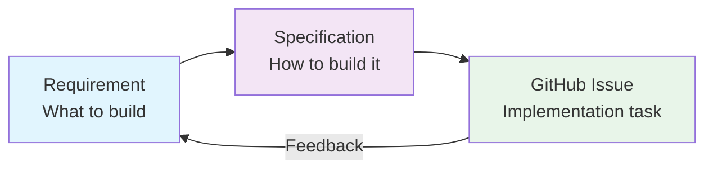

> **Summary**: What Reqord achieves and who it is built for. Feature overview and scope definition.

# Purpose — What It Achieves and For Whom

> [日本語](./02-purpose.ja.md)

## Vision

Make the transformation from "ideas" to "implementable tasks" structural and traceable.

## Workflow Overview

Reqord's 3-layer model:

| Layer             | Role              | Example                                        |
| ----------------- | ----------------- | ---------------------------------------------- |
| **Requirement**   | What to build     | "Users can log in via email"                   |
| **Specification** | How to build it   | "OAuth2 + JWT, session management with Redis"  |
| **GitHub Issue**  | Implementation task | "Implement POST /auth/login endpoint"        |

The feedback loop ensures that insights from implementation flow back into requirement and specification updates.

## Target Users

### Development Teams (Tech Leads + Developers)

**Challenges**: Ensuring quality, traceability of design decisions, inconsistent understanding of requirements across the team

**Value Reqord Provides**:

- PR-based approval workflow (CODEOWNERS review)
- Requirement -> Specification -> Issue tracing chain
- Objective evaluation of requirement quality via SMART validation
- Visualize the impact scope of changes through a dependency graph

### Product Owners

**Challenges**: Tracking progress, grasping the full picture of requirements, understanding dependencies between features

**Value Reqord Provides**:

- Overview of progress on the Web UI dashboard
- Visualize relationships between features with a dependency graph
- Clear state tracking via status lifecycle (draft -> approved -> implemented)

### AI-Driven Development Teams

**Challenges**: Ambiguous instructions to AI result in unstable output quality, context is lost between sessions

**Additional Value Reqord Provides**:

- Structured requirements serve as clear input for AI
- ProjectContext (product.yaml, technical.yaml, domain/\*.md) provides consistent context for every AI session
- Humans can always understand "what has been decided, what has been implemented, and what remains" through Reqord

## Core Features Overview

### ProjectContext Management

Manage project-wide context in a structured manner:

- `context.json` — Project metadata
- `product.yaml` — Vision, challenges, target users
- `technical.yaml` — Technology stack, architecture
- `structure.yaml` — Naming conventions, directory structure
- `domain/*.md` — Domain-specific knowledge

### Requirement CRUD + SMART Validation

- Create, list, update, and delete requirements
- Supports EARS / User Story / Free-form formats
- Quality scoring based on SMART criteria (Specific, Measurable, Achievable, Relevant, Time-bound)

### Specification Design

- Create and manage specifications (design.md) linked to requirements
- AI-assisted technical design generation
- Detailed specification documents including Mermaid diagrams and code examples

### GitHub Issue Generation

- Break down specifications into implementation tasks
- Define execution order reflecting dependencies
- Group tasks that can be executed in parallel

### PR-Based Approval Flow

- `reqord req approve` creates a PR and changes status to pending_approval
- Review by CODEOWNERS
- PR merge finalizes the status as approved

### Feedback Synchronization

- Feed GitHub Issue feedback back into requirements and specifications
- Flag system to manage the "approved but has feedback" state
- Gradual structuring (discuss in Issues first -> structure in Reqord as needed)

### Web UI

- Progress visualization on the dashboard
- Dependency graph
- Browse and edit requirements and specifications

## Scope

### IN (Covered)

- Requirements lifecycle management (creation -> approval -> implementation tracking -> feedback -> updates)
- Specification design and management
- GitHub Issue generation
- PR-based approval workflow
- Quality evaluation via SMART validation
- AI assistance (requirement refinement, specification design, task breakdown)
- Visualization via Web UI

### OUT (Not Covered)

- **Code generation**: Reqord covers requirements and specifications only. It does not write code
- **Real-time collaborative editing**: Git-based asynchronous collaboration
- **General project management**: Sprint planning, resource allocation, Gantt charts

## Good Fit / Not a Good Fit

### Good Fit

- Traceability from requirements to implementation is needed
- A flow exists for multiple people to review and approve requirements
- Medium to large projects (10+ requirements)
- Want to improve requirement quality and consistency in AI-driven development

### Not a Good Fit

- Prototypes and hackathons (speed is the priority; the overhead of structuring is not worth it)
- Small scripts completed by a single person
- Phases where requirements change drastically and frequently (more effective to introduce once the direction is established)

## Start Gradually

Reqord can be started with a minimal configuration:

1. **Minimal setup**: `reqord init` + create 3-5 requirements
2. **AI utilization**: Enrich ProjectContext and start using enhance/refine
3. **Approval flow**: Introduce PR-based reviews with team members
4. **Specifications & Issues**: Leverage specification design and GitHub Issue generation
5. **Full stack**: Web UI, feedback synchronization, dashboard

There is no need to adopt everything at once. Scale gradually to match your project's maturity.

---

**Next**: [03-theory.md](./03-theory.md) — Adopted methodologies and rationale
