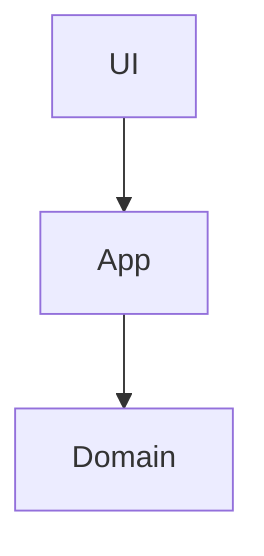
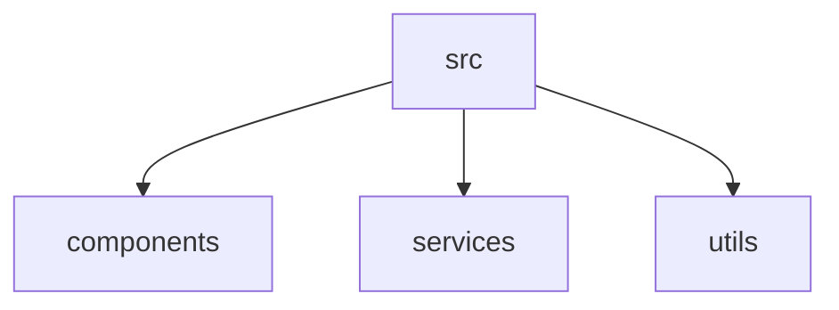

# Reqord - Full Specification v2.0

> [日本語](./specification.ja.md)

## Concept

**"A requirements management tool for structured AI-driven development"**

A local-first requirements management tool for AI-driven developers to seamlessly handle the entire workflow from requirements definition to specification design and GitHub Issue generation.

### Design Principles

1. **Structure First** - Hybrid of JSON (metadata) + Markdown (content)
2. **Local Complete** - GitHub repository as SSoT, no backend required
3. **AI-Driven Optimization** - Designed for integration with LLM tools like Claude Code
4. **Visualization Focus** - Dependency graphs and progress tracking via Web UI

---

## Directory Structure

```
project-root/
├── .reqord/
│   ├── context/                          # Project context (Steering)
│   │   ├── context.json                  # Metadata
│   │   ├── product.yaml                    # Product vision
│   │   ├── technical.yaml                  # Tech stack, Architecture
│   │   ├── structure.yaml                  # Code structure, Naming conventions
│   │   └── domain/                       # Domain knowledge (custom)
│   │       ├── api-standards.md
│   │       ├── security.md
│   │       └── accessibility.md
│   │
│   ├── requirements/                     # Requirements
│   │   ├── req-001.json                  # Metadata only
│   │   ├── req-001/
│   │   │   ├── description.md            # Detailed description (Markdown, required)
│   │   │   ├── mockup.png               # Supplementary: images, etc.
│   │   │   └── diagram.mmd              # Supplementary: Mermaid diagrams, etc.
│   │   ├── req-002.json
│   │   └── req-002/
│   │       └── description.md
│   │
│   ├── specifications/                   # Specifications
│   │   ├── spec-001.json                 # Metadata only
│   │   ├── spec-001/
│   │   │   ├── design.md                 # Design document (required)
│   │   │   ├── research.md               # Supplementary: research notes
│   │   │   ├── architecture.mmd          # Supplementary: Mermaid diagrams
│   │   │   └── examples/                 # Supplementary: code examples
│   │   │       └── api-example.ts
│   │   ├── spec-002.json
│   │   └── spec-002/
│   │       └── design.md
│   │
│   ├── settings/                         # Templates & rules
│   │   ├── templates/
│   │   │   ├── requirement-description.md
│   │   │   ├── specification-design.md
│   │   │   └── issue-body.md
│   │   └── rules/
│   │       ├── requirement-generation.md
│   │       ├── design-review.md
│   │       └── parallel-analysis.md
│   │
│   └── assets/                           # Shared assets such as images
│       └── logo.png
│
├── .github/
│   ├── ISSUE_TEMPLATE/                   # GitHub Issue Templates
│   │   ├── reqord-implementation.yml     # Basic implementation task
│   │   ├── reqord-database.yml           # DB implementation
│   │   ├── reqord-api.yml                # API implementation
│   │   ├── reqord-ui.yml                 # UI implementation
│   │   └── reqord-test.yml               # Test implementation
│   └── CODEOWNERS                        # Approval authority management
│
└── (project files)
```

---

## Data Structures

### ProjectContext (context.json)

```typescript
{
  // Meta information
  "id": "llyssm",
  "name": "LLySSM",
  "version": "1.0.0",
  "language": "en",  // Language for generated documents

  // External file references
  "files": {
    "product": "context/product.yaml",
    "technical": "context/technical.yaml",
    "structure": "context/structure.yaml",
    "domain": [
      "context/domain/api-standards.md",
      "context/domain/security.md"
    ]
  }
}
```

### Product Context (context/product.yaml)

```markdown
# Product Vision

## Vision

Why we build this (200 characters or less)

## Problem Statement

The problem to solve (200 characters or less)

## Target Users

- Structural engineers
- BIM specialists

## Core Features

- Core feature 1
- Core feature 2

## Value Proposition

Unique value (100 characters or less)

## Out of Scope

- Out of scope item 1
- Out of scope item 2
```

### Technical Context (context/technical.yaml)

````markdown
# Technical Context

## Architecture



## Tech Stack

### Language

- **TypeScript 5.x** - Type-safe development

### Runtime

- **Node.js 20+** - Modern JavaScript runtime

### Framework

- **Next.js 15** - React SSR

### Library

- **xBIM Toolkit** - IFC processing

## Development Environment

### Required Tools

- Node.js 20+
- Git

### Setup Commands

```bash
npm install
npm run dev
```

## Common Commands

- `npm run dev` - Start development server
- `npm run build` - Build

## Design Patterns

- **Repository Pattern** - Abstraction of the data access layer
- **Factory Pattern** - Object creation
````

### Structure Context (context/structure.yaml)

````markdown
# Code Structure

## File Organization



## Naming Conventions

### Files

- Convention: `kebab-case`
- Example: `user-service.ts`

### Classes

- Convention: `PascalCase`
- Example: `UserService`

### Functions

- Convention: `camelCase`
- Example: `getUserById`

### Variables

- Convention: `camelCase`
- Example: `userName`

### Constants

- Convention: `UPPER_SNAKE_CASE`
- Example: `MAX_RETRY_COUNT`

## Import Rules

### Preferred

- Absolute imports: `@/components/Button`
- Named exports: `export const Button`

### Forbidden

- Default exports (except Next.js pages)
- Circular dependencies

## Architectural Rules

- Each layer must not depend on upper layers
- The Domain layer must not depend on any framework
````

### Requirement (requirements/req-001.json)

```typescript
{
  // Meta information
  "id": "req-001",
  "version": "1.1.0",
  "title": "IFC Export Feature",
  "status": "approved",  // draft | pending_approval | approved | implemented | deprecated
  "priority": "high",    // low | medium | high
  "createdAt": "2026-02-01T10:00:00Z",
  "updatedAt": "2026-02-05T15:30:00Z",

  // Version history (approval tracking)
  "versionHistory": [
    {
      "version": "1.0.0",
      "status": "approved",
      "gitCommit": "abc123def456",
      "approvedAt": "2026-02-05T10:00:00Z",
      "approvedBy": ["@tech-lead"]
    },
    {
      "version": "1.1.0",
      "status": "approved",
      "gitCommit": "def456ghi789",
      "approvedAt": "2026-02-10T15:00:00Z",
      "approvedBy": ["@tech-lead", "@architect"]
    }
  ],

  // External file references
  "files": {
    "description": "requirements/req-001/description.md",
    "supplementary": [
      "requirements/req-001/mockup.png",
      "requirements/req-001/diagram.mmd"
    ]
  },

  // Structured data (in JSON)
  "successCriteria": [
    "Output in IFC4 format",
    "Only structural elements are extracted",
    "Attributes are fully preserved"
  ],

  // Format
  "format": {
    "type": "ears",  // ears | user-story | free-form
    "ears": {
      "type": "event-driven",  // ubiquitous | event-driven | state-driven | optional | unwanted
      "trigger": "user exports model",
      "condition": "model contains structural elements",
      "action": "the system shall export to IFC4 format",
      "response": "preserving all structural attributes"
    }
  },

  // Dependencies
  "dependencies": {
    "blockedBy": [],
    "blocks": ["req-003"],
    "relatedTo": ["req-002"]
  },

  // Impact scope (auto-calculated)
  "impact": {
    "specifications": ["spec-001"],
    "issues": [],
    "requirements": ["req-003"]
  },

  // Gap Analysis results
  "gapAnalysis": {
    "analyzedAt": "2026-02-10T14:00:00Z",
    "existingImplementations": [
      {
        "file": "src/export/ifc-exporter.ts",
        "coverage": "partial",
        "notes": "Only supports IFC2x3, IFC4 not yet supported"
      }
    ],
    "missingFeatures": [
      "IFC4 schema support",
      "Attribute mapping"
    ],
    "conflicts": [
      {
        "requirement": "IFC4 format",
        "existingCode": "src/export/ifc-exporter.ts:45",
        "issue": "Currently implemented with IFC2x3"
      }
    ]
  },

  // Estimation
  "estimatedComplexity": "medium",  // small | medium | large | xlarge
  "estimatedHours": 16
}
```

### Requirement Description (requirements/req-001/description.md)

```markdown
# IFC Export Feature

## Overview

A feature to export model data to IFC format using the Revit API.

## Detailed Requirements

### EARS Format Requirement

When a user exports a model,
if the model contains structural elements,
the system shall export to IFC4 format,
preserving all structural attributes.

### Technical Constraints

- IFC4 format compliant
- Structural elements only (architectural elements excluded)
- Attribute mapping required

## Use Cases

1. User creates a model in Revit
2. Clicks the "Export to IFC" button
3. Only structural elements are extracted
4. File is saved in IFC4 format

## References

- [IFC4 Specification](https://standards.buildingsmart.org/IFC/RELEASE/IFC4/ADD2_TC1/HTML/)
- [xBIM Toolkit Documentation](https://docs.xbim.net/)
```

### Specification (specifications/spec-001.json)

```typescript
{
  // Meta information
  "id": "spec-001",
  "requirementId": "req-001",
  "version": "1.0.0",
  "status": "approved",  // draft | pending_approval | approved | implemented | deprecated
  "createdAt": "2026-02-06T10:00:00Z",
  "updatedAt": "2026-02-06T16:00:00Z",

  // Version history (approval tracking)
  "versionHistory": [
    {
      "version": "1.0.0",
      "status": "approved",
      "gitCommit": "ghi789jkl012",
      "approvedAt": "2026-02-06T16:00:00Z",
      "approvedBy": ["@architect", "@tech-lead"]
    }
  ],

  // External file references
  "files": {
    "design": "specifications/spec-001/design.md",
    "supplementary": [
      "specifications/spec-001/research.md",
      "specifications/spec-001/architecture.mmd",
      "specifications/spec-001/examples/ifc-exporter.ts",
      "specifications/spec-001/examples/attribute-mapper.ts"
    ]
  }
}
```

### Specification Design (specifications/spec-001/design.md)

````markdown
# IFC Exporter - Technical Design

## 1. Design Overview

Design for the feature that exports model data to IFC4 format using the Revit API.

## 2. Architecture

See [architecture.mmd](./architecture.mmd) for interactive diagram.

## 3. Component Design

### 3.1 IFC Exporter Module

**Responsibility:** Read a Revit model and convert it to IFC4 format

**Interface:**

```typescript
interface IFCExporter {
  export(model: RevitModel, options: ExportOptions): Promise<IFCFile>;
}
```

**Implementation:** See [examples/ifc-exporter.ts](./examples/ifc-exporter.ts)

### 3.2 Attribute Mapper

**Responsibility:** Map Revit attributes to IFC attributes

**Interface:**

```typescript
interface AttributeMapper {
  map(revitProperty: Property): IFCProperty;
}
```

**Implementation:** See [examples/attribute-mapper.ts](./examples/attribute-mapper.ts)

## 4. Data Flow

1. User triggers export
2. IFCExporter reads Revit model
3. Filter structural elements
4. AttributeMapper maps properties
5. Generate IFC4 file
6. Save to disk

## 5. Testing Strategy

### Unit Tests

- IFCExporter unit tests
- AttributeMapper unit tests

### Integration Tests

- End-to-end export tests
- Verification with various Revit models

## 6. Technical Decisions

### Decision 1: Adopt xBIM Toolkit

**Rationale:** Open source, proven track record, C# native
**Alternatives:** IfcOpenShell (Python), custom implementation
**Tradeoffs:** C# dependency, but good performance
````

---

## Workflow

### Overall Flow

```

1. Create ProjectContext (first time only)
   ↓
2. Create Requirement (Draft)
   ↓
3. AI Refinement (optional)
   ↓
4. Gap Analysis (existing projects only)
   ↓
5. Request Approval (Requirements Phase)
   - Create Git branch
   - Create Pull Request
     ↓
6. Review & Approval
   - CODEOWNERS approval
   - Merge → Approved
     ↓
7. Create Specification (Draft)
   - Design (create design document)
     ↓
8. Design Validation
   ↓
9. Request Approval (Specification Phase)
   ↓
10. Generate GitHub Issues
    - AI decomposition (including parallel analysis)
    - Apply Issue Templates
    - Create GitHub Issues
      ↓
11. Implementation (on GitHub Issues)
    ↓
12. Issue Completed → Update Specification progress

```

### Version Management Flow

```

Requirement v1.0.0 (Approved)
↓
Change needed
↓
┌────────────┬────────────┐
│ Option A │ Option B │
│ Revoke │ New Version│
└────┬───────┴─────┬──────┘
↓ ↓
v1.0.0 (draft) v1.0.0 (deprecated)
v1.1.0 (draft)
↓ ↓
Impact analysis

- spec-001 (outdated)
- Issue #12, #13 (flagged)
- req-003 (may need review)
  ↓
  Edit → Request re-approval → Create PR
  ↓
  Approved → New version Approved

```

---

## CLI Commands

```bash
# Initialization
reqord init                                    # Create .reqord/ + GitHub Issue Templates
reqord context init                            # Create ProjectContext

# Context management
reqord context edit                            # Edit in Web UI
reqord context domain add api-standards        # Add domain rule

# Requirement management
reqord req create "IFC Export Feature"
reqord req enhance req-001                     # AI refinement
reqord req format req-001 ears                 # Convert to EARS format
reqord req gap-analysis req-001                # Diff analysis against existing code
reqord req approve req-001                     # Request approval (create PR)
reqord req version create req-001              # Create new version
reqord req version list req-001                # List versions

# Specification management
reqord spec create req-001
reqord spec design spec-001                    # View/update design document
reqord spec validate spec-001                  # Design validation
reqord spec approve spec-001                   # Request approval (create PR)

# Issue management
reqord issue create spec-001                   # Generate GitHub Issues (AI decomposition)
reqord issue create spec-001 --strategy by-layer  # Decompose by layer
reqord issue sync spec-001                     # Sync Issue status
reqord issue sync-all                          # Sync all Specs
reqord issue validate spec-001                 # Metadata consistency check

# Validation
reqord validate gap req-001                    # Gap Analysis
reqord validate design spec-001                # Design validation
reqord validate impl spec-001                  # Implementation validation

# Impact analysis
reqord impact analyze req-001                  # Impact scope analysis
reqord impact notify req-001                   # Notify impacted targets

# Preview
reqord preview                                 # Launch localhost:3000

# Context output (for LLM)
reqord context req-001                         # Output context for LLM
reqord context req-001 | claude code           # Pipe directly to Claude Code

# Status
reqord status                                  # Entire project
reqord status req-001                          # Requirement details
reqord status spec-001                         # Specification details
```

---

## Web UI Screen Layout

### Dashboard

```
┌─────────────────────────────────────────────────┐
│ Reqord - LLySSM                      [Settings] │
├─────────────────────────────────────────────────┤
│ Project Health                                   │
│ Requirements: ████████░░ 8/10 Approved          │
│ Specifications: ██████░░░░ 6/10 Approved        │
│ Issues: ████████████░░ 12/15 Completed          │
│ Critical Path: 9h remaining ✅                  │
│                                                  │
│ ┌──────────────┬──────────────┬───────────────┐ │
│ │ Requirements │ Specs        │ Issues        │ │
│ │ 8 Approved   │ 6 Approved   │ 12 Completed  │ │
│ │ 2 Draft      │ 4 Draft      │ 3 In Progress │ │
│ │ ⚠️ 1 Gap     │ ⚠️ 2 Conflicts│ 🔴 1 Blocked │ │
│ └──────────────┴──────────────┴───────────────┘ │
│                                                  │
│ Dependency Graph                                 │
│ [Interactive Mermaid Diagram]                    │
└─────────────────────────────────────────────────┘
```

### Requirement Details

```
┌─────────────────────────────────────────────────┐
│ req-001: IFC Export Feature           v1.1.0 ✅  │
│ [Basic] [Gap Analysis] [History]                │
├─────────────────────────────────────────────────┤
│ Title: IFC Export Feature                        │
│                                                  │
│ Description (Markdown Editor)                    │
│ [Edit] [Preview]                                 │
│                                                  │
│ Format: [EARS ▼]                                │
│ When: user exports model                         │
│ If: model contains structural elements           │
│ The system shall: export to IFC4 format          │
│ Then: preserving all structural attributes       │
│                                                  │
│ Success Criteria                                 │
│ ☑ Output in IFC4 format                         │
│ ☑ Only structural elements extracted             │
│ ☑ Attributes fully preserved                     │
│                                                  │
│ Dependencies                                     │
│ Blocked By: None                                 │
│ Blocks: req-003                                  │
│ [View Graph]                                     │
│                                                  │
│ [🤖 AI Enhance] [📊 Gap Analysis] [✅ Approve]  │
└─────────────────────────────────────────────────┘
```

### Specification Details

```
┌─────────────────────────────────────────────────┐
│ spec-001: IFC Exporter              v1.0.0 ✅   │
│ [Design] [Files] [Issues] [History]              │
├─────────────────────────────────────────────────┤
│ === Issues Tab ===                               │
│                                                  │
│ Progress: 3/6 completed (50%)                    │
│ Timeline: 5h remaining (Parallel mode)           │
│                                                  │
│ Gantt Chart                                      │
│ P0 ███ task-123 (2h) ✅                         │
│ P1 ██████ task-124 (4h) 🔄                      │
│ P1 ███ task-125 (2h) ☐                          │
│ P2 █████ task-128 (3h) 🔴 ⏳                     │
│                                                  │
│ Issue List                                       │
│ ✅ #123: IFC4 schema (P0, 2h) @bob              │
│ 🔄 #124: Attribute mapper (P1, 4h) @alice       │
│ ☐ #125: UI button (P1, 2h) Unassigned           │
│                                                  │
│ [Generate Issues] [Sync] [View on GitHub]       │
└─────────────────────────────────────────────────┘
```

---

## GitHub Issue Template Example

```yaml
# .github/ISSUE_TEMPLATE/reqord-implementation.yml

name: 🔨 Implementation Task (from Reqord)
description: Implementation task auto-generated from Reqord specification
title: "[IMPL]: "
labels: ["reqord-generated", "implementation"]
body:
  - type: markdown
    attributes:
      value: |
        ## 📋 Auto-generated from Reqord Specification

  - type: input
    id: spec_id
    attributes:
      label: Specification ID
      placeholder: spec-001
    validations:
      required: true

  - type: input
    id: requirement_ids
    attributes:
      label: Requirement IDs
      placeholder: req-001, req-002
    validations:
      required: true

  - type: dropdown
    id: parallel_group
    attributes:
      label: Parallel Group
      options:
        - P0 (Sequential - Must complete first)
        - P1 (Parallel - Can run concurrently)
        - P2 (Parallel - Can run concurrently)
    validations:
      required: true

  - type: dropdown
    id: critical_path
    attributes:
      label: Critical Path
      options:
        - "Yes"
        - "No"
    validations:
      required: true

  - type: input
    id: estimated_hours
    attributes:
      label: Estimated Hours
      placeholder: "4"
    validations:
      required: true

  - type: textarea
    id: description
    attributes:
      label: Description
    validations:
      required: true

  - type: textarea
    id: acceptance_criteria
    attributes:
      label: Acceptance Criteria
      placeholder: |
        - [ ] Criteria 1
        - [ ] Criteria 2
    validations:
      required: true

  - type: markdown
    attributes:
      value: |
        ---
        ### 🔗 Reqord Metadata
        <!-- reqord:specification {"specificationId":"spec-001"} -->
```

---

## AI Features

### 1. Requirement Refinement

- Input: Simple title and description
- Output: Detailed description.md + success criteria + estimation

### 2. Gap Analysis

- Input: Requirement + existing codebase
- Output: Existing implementation coverage + missing features + conflicts

### 3. Tech Stack Suggestions

- Input: Project description
- Output: Recommended stack + patterns

### 4. Automatic Dependency Detection

- Input: Multiple Requirements
- Output: Dependency graph

### 5. Design Generation

- Input: Requirement + ProjectContext
- Output: design.md + supplementary materials (architecture diagrams, code examples, etc.)

### 6. Issue Decomposition + Parallel Analysis

- Input: Specification
- Output: GitHub Issues + parallel groups + critical path

---

## Tech Stack

### CLI

- Node.js 20+
- TypeScript
- Commander.js
- Inquirer.js
- Octokit.js (GitHub API)

### Web UI

- Next.js 15 (App Router)
- TypeScript
- Tailwind CSS
- React Markdown
- Mermaid.js
- Recharts (Gantt Chart)

### AI Integration

- Anthropic SDK (Claude API)
- User-provided API key

### Deployment

- Vercel (Web UI)
- npm registry (CLI)

---

## Development Roadmap

### Phase 1: MVP (3-4 weeks)

- ✅ CLI basics + directory structure
- ✅ ProjectContext CRUD
- ✅ Requirement CRUD (JSON + Markdown)
- ✅ Local UI (basic CRUD)
- ✅ AI requirement refinement

**Release: v0.1.0**

### Phase 2: Approval & Version Management (2 weeks)

- ✅ Version management
- ✅ GitHub PR approval flow
- ✅ CODEOWNERS integration
- ✅ Impact scope analysis

**Release: v0.2.0**

### Phase 3: Specification + Issue (2 weeks)

- ✅ Specification CRUD
- ✅ Design + Supplementary structure
- ✅ GitHub Issue Template
- ✅ AI Issue decomposition + parallel analysis
- ✅ Issue sync

**Release: v0.3.0**

### Phase 4: Validation Features (1 week)

- ✅ Gap Analysis
- ✅ Design Validation

**Release: v0.4.0**

### Phase 5: Public Web UI (1 week)

- ✅ Vercel deployment
- ✅ Dependency graph visualization
- ✅ Gantt Chart

**Release: v1.0.0**
