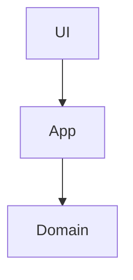
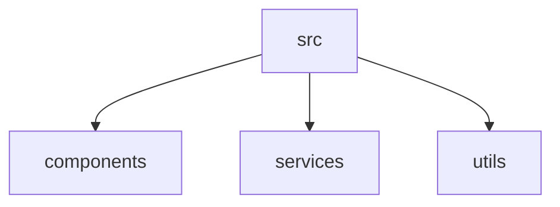

# Reqord - 完全仕様書 v2.0

## コンセプト

**「構造化されたAI駆動開発のための要件管理ツール」**

AI駆動開発者が、要件定義から仕様設計、GitHub Issue生成までをシームレスに行うための、ローカルファーストな要件管理ツール。

### 設計原則

1. **構造化第一** - JSON(メタデータ) + Markdown(コンテンツ)のハイブリッド
2. **ローカル完結** - GitHubリポジトリがSSoT、バックエンドレス
3. **AI駆動最適化** - Claude Code等のLLMツールとの統合を前提
4. **視覚化重視** - Web UIでの依存関係グラフ、進捗追跡

---

## ディレクトリ構成

```
project-root/
├── .reqord/
│   ├── context/                          # プロジェクトコンテキスト(Steering)
│   │   ├── context.json                  # メタデータ
│   │   ├── product.md                    # Product vision
│   │   ├── technical.md                  # Tech stack, Architecture
│   │   ├── structure.md                  # Code structure, Naming conventions
│   │   └── domain/                       # ドメイン知識(カスタム)
│   │       ├── api-standards.md
│   │       ├── security.md
│   │       └── accessibility.md
│   │
│   ├── requirements/                     # 要件
│   │   ├── req-001.json                  # メタデータのみ
│   │   ├── req-001/
│   │   │   ├── description.md            # 詳細説明(Markdown)
│   │   │   └── attachments/              # 添付ファイル
│   │   │       ├── mockup.png
│   │   │       └── diagram.mmd
│   │   ├── req-002.json
│   │   └── req-002/
│   │       └── description.md
│   │
│   ├── specifications/                   # 仕様
│   │   ├── spec-001.json                 # メタデータのみ
│   │   ├── spec-001/
│   │   │   ├── research.md               # 調査ノート(オプション)
│   │   │   ├── design.md                 # 設計書
│   │   │   ├── architecture.mmd          # Mermaid図(オプション)
│   │   │   └── examples/                 # コード例(オプション)
│   │   │       ├── api-example.ts
│   │   │       ├── test-example.ts
│   │   │       └── schema.sql
│   │   ├── spec-002.json
│   │   └── spec-002/
│   │       └── design.md
│   │
│   ├── settings/                         # テンプレート・ルール
│   │   ├── templates/
│   │   │   ├── requirement-description.md
│   │   │   ├── specification-research.md
│   │   │   ├── specification-design.md
│   │   │   └── issue-body.md
│   │   └── rules/
│   │       ├── requirement-generation.md
│   │       ├── design-review.md
│   │       └── parallel-analysis.md
│   │
│   └── assets/                           # 画像等の共有アセット
│       └── logo.png
│
├── .github/
│   ├── ISSUE_TEMPLATE/                   # GitHub Issue Templates
│   │   ├── reqord-implementation.yml     # 基本実装タスク
│   │   ├── reqord-database.yml           # DB実装
│   │   ├── reqord-api.yml                # API実装
│   │   ├── reqord-ui.yml                 # UI実装
│   │   └── reqord-test.yml               # テスト実装
│   └── CODEOWNERS                        # 承認権限管理
│
└── (プロジェクトファイル)
```

---

## データ構造

### ProjectContext (context.json)

```typescript
{
  // メタ情報
  "id": "llyssm",
  "name": "LLySSM",
  "version": "1.0.0",
  "language": "en",  // 生成ドキュメントの言語

  // 外部ファイル参照
  "files": {
    "product": "context/product.md",
    "technical": "context/technical.md",
    "structure": "context/structure.md",
    "domain": [
      "context/domain/api-standards.md",
      "context/domain/security.md"
    ]
  }
}
```

### Product Context (context/product.md)

```markdown
# Product Vision

## Vision

なぜ作るか（200字以内）

## Problem Statement

解決する課題（200字以内）

## Target Users

- 構造エンジニア
- BIM担当者

## Core Features

- 主要機能1
- 主要機能2

## Value Proposition

独自価値（100字以内）

## Out of Scope

- やらないこと1
- やらないこと2
```

### Technical Context (context/technical.md)

````markdown
# Technical Context

## Architecture



## Tech Stack

### Language

- **TypeScript 5.x** - 型安全な開発

### Runtime

- **Node.js 20+** - モダンなJavaScript実行環境

### Framework

- **Next.js 15** - React SSR

### Library

- **xBIM Toolkit** - IFC処理

## Development Environment

### Required Tools

- Node.js 20+
- Git

### Setup Commands

```bash
npm install
npm run dev
```

## Common Commands

- `npm run dev` - 開発サーバー起動
- `npm run build` - ビルド

## Design Patterns

- **Repository Pattern** - データアクセス層の抽象化
- **Factory Pattern** - オブジェクト生成
````

### Structure Context (context/structure.md)

````markdown
# Code Structure

## File Organization



## Naming Conventions

### Files

- Convention: `kebab-case`
- Example: `user-service.ts`

### Classes

- Convention: `PascalCase`
- Example: `UserService`

### Functions

- Convention: `camelCase`
- Example: `getUserById`

### Variables

- Convention: `camelCase`
- Example: `userName`

### Constants

- Convention: `UPPER_SNAKE_CASE`
- Example: `MAX_RETRY_COUNT`

## Import Rules

### Preferred

- Absolute imports: `@/components/Button`
- Named exports: `export const Button`

### Forbidden

- Default exports (except Next.js pages)
- Circular dependencies

## Architectural Rules

- 各レイヤーは上位レイヤーに依存しない
- Domain層はフレームワークに依存しない
````

### Requirement (requirements/req-001.json)

```typescript
{
  // メタ情報
  "id": "req-001",
  "version": "1.1.0",
  "title": "IFCエクスポート機能",
  "status": "approved",  // draft | pending_approval | approved | deprecated
  "priority": "high",    // low | medium | high
  "createdAt": "2026-02-01T10:00:00Z",
  "updatedAt": "2026-02-05T15:30:00Z",

  // バージョン履歴
  "versionHistory": [
    {
      "version": "1.0.0",
      "status": "approved",
      "gitCommit": "abc123def456",
      "approvedAt": "2026-02-05T10:00:00Z",
      "approvedBy": ["@tech-lead"]
    },
    {
      "version": "1.0.0",
      "status": "deprecated",
      "deprecatedAt": "2026-02-10T09:00:00Z",
      "deprecatedReason": "IFC version upgrade needed"
    },
    {
      "version": "1.1.0",
      "status": "approved",
      "gitCommit": "def456ghi789",
      "approvedAt": "2026-02-10T15:00:00Z",
      "approvedBy": ["@tech-lead", "@architect"]
    }
  ],

  // 現在の承認情報
  "currentApproval": {
    "version": "1.1.0",
    "phase": "requirements",
    "status": "approved",
    "prNumber": 123,
    "approvedAt": "2026-02-10T15:00:00Z",
    "approvedBy": ["@tech-lead", "@architect"]
  },

  // 外部ファイル参照
  "files": {
    "description": "requirements/req-001/description.md",
    "attachments": [
      "requirements/req-001/attachments/mockup.png"
    ]
  },

  // 構造化データ(JSON内)
  "successCriteria": [
    "IFC4形式で出力される",
    "構造要素のみ抽出される",
    "属性が完全に保持される"
  ],

  // フォーマット
  "format": {
    "type": "ears",  // ears | user-story | free-form
    "ears": {
      "type": "event-driven",  // ubiquitous | event-driven | state-driven | optional | unwanted
      "trigger": "user exports model",
      "condition": "model contains structural elements",
      "action": "the system shall export to IFC4 format",
      "response": "preserving all structural attributes"
    }
  },

  // 依存関係
  "dependencies": {
    "blockedBy": [],
    "blocks": ["req-003"],
    "relatedTo": ["req-002"]
  },

  // 影響範囲(自動計算)
  "impact": {
    "specifications": ["spec-001"],
    "issues": [],
    "requirements": ["req-003"]
  },

  // Gap Analysis結果
  "gapAnalysis": {
    "analyzedAt": "2026-02-10T14:00:00Z",
    "existingImplementations": [
      {
        "file": "src/export/ifc-exporter.ts",
        "coverage": "partial",
        "notes": "IFC2x3のみ対応、IFC4未対応"
      }
    ],
    "missingFeatures": [
      "IFC4スキーマ対応",
      "属性マッピング"
    ],
    "conflicts": [
      {
        "requirement": "IFC4形式",
        "existingCode": "src/export/ifc-exporter.ts:45",
        "issue": "現在IFC2x3で実装されている"
      }
    ]
  },

  // 見積もり
  "estimatedComplexity": "medium",  // small | medium | large | xlarge
  "estimatedHours": 16
}
```

### Requirement Description (requirements/req-001/description.md)

```markdown
# IFCエクスポート機能

## 概要

Revit APIを使用してモデルデータをIFC形式でエクスポートする機能。

## 詳細要件

### EARS形式要件

When a user exports a model,
if the model contains structural elements,
the system shall export to IFC4 format,
preserving all structural attributes.

### 技術的制約

- IFC4形式準拠
- 構造要素のみ対象(意匠要素は除外)
- 属性マッピング必須

## ユースケース

1. ユーザーがRevitでモデルを作成
2. "Export to IFC"ボタンをクリック
3. 構造要素のみを抽出
4. IFC4形式でファイル保存

## 参考資料

- [IFC4 Specification](https://standards.buildingsmart.org/IFC/RELEASE/IFC4/ADD2_TC1/HTML/)
- [xBIM Toolkit Documentation](https://docs.xbim.net/)
```

### Specification (specifications/spec-001.json)

```typescript
{
  // メタ情報
  "id": "spec-001",
  "requirementId": "req-001",
  "version": "1.0.0",
  "status": "approved",  // draft | pending_approval | approved
  "createdAt": "2026-02-06T10:00:00Z",
  "updatedAt": "2026-02-06T16:00:00Z",

  // バージョン履歴
  "versionHistory": [
    {
      "version": "1.0.0",
      "status": "approved",
      "gitCommit": "ghi789jkl012",
      "approvedAt": "2026-02-06T16:00:00Z",
      "approvedBy": ["@architect", "@tech-lead"]
    }
  ],

  // 承認情報
  "currentApproval": {
    "version": "1.0.0",
    "phase": "specification",
    "status": "approved",
    "prNumber": 125,
    "approvedAt": "2026-02-06T16:00:00Z",
    "approvedBy": ["@architect", "@tech-lead"]
  },

  // 外部ファイル参照
  "files": {
    "research": "specifications/spec-001/research.md",
    "design": "specifications/spec-001/design.md",
    "architecture": "specifications/spec-001/architecture.mmd",
    "examples": [
      "specifications/spec-001/examples/ifc-exporter.ts",
      "specifications/spec-001/examples/attribute-mapper.ts"
    ]
  },

  // 要件カバレッジ
  "requirementCoverage": {
    "req-001": {
      "status": "covered",  // covered | partial | not-covered
      "notes": "完全カバー",
      "designSection": "3.1"
    },
    "req-002": {
      "status": "partial",
      "notes": "属性マッピングのみ",
      "designSection": "3.2"
    }
  },

  // 技術的決定
  "technicalDecisions": [
    {
      "decision": "xBIM Toolkitを使用",
      "rationale": "オープンソースで実績あり",
      "alternatives": ["IfcOpenShell", "独自実装"],
      "tradeoffs": "C#依存だがパフォーマンス良好"
    }
  ],

  // Design Validation結果
  "designValidation": {
    "validatedAt": "2026-02-06T15:00:00Z",
    "architectureAlignment": {
      "patterns": [
        { "pattern": "Repository Pattern", "status": "ok" },
        { "pattern": "Factory Pattern", "status": "ok" }
      ]
    },
    "namingConventions": [
      {
        "file": "ifc-exporter.ts",
        "expected": "ifc-exporter.ts",
        "status": "ok"
      }
    ],
    "dependencyConflicts": []
  },

  // GitHub Issue実装管理
  "implementation": {
    // 分解戦略
    "breakdown": {
      "strategy": "by-layer",  // by-layer | by-feature | by-requirement | custom
      "parallelAnalysis": {
        "sequentialDuration": 11,
        "parallelDuration": 9,
        "criticalPath": [123, 124, 128],
        "parallelGroups": {
          "P0": [123],
          "P1": [124, 125, 126],
          "P2": [127, 128]
        }
      }
    },

    // 生成されたIssue
    "issues": [
      {
        "number": 123,
        "url": "https://github.com/user/repo/issues/123",
        "title": "Setup IFC4 schema support",
        "body": "...",
        "state": "closed",
        "assignees": ["@bob"],
        "labels": ["reqord-generated", "spec:spec-001", "req:req-001", "P0", "critical-path"],
        "metadata": {
          "specificationId": "spec-001",
          "requirementIds": ["req-001"],
          "parallelGroup": 0,
          "isCriticalPath": true,
          "estimatedHours": 2,
          "dependencies": [],
          "generatedAt": "2026-02-07T10:00:00Z",
          "reqordVersion": "2.0.0"
        },
        "createdAt": "2026-02-07T10:00:00Z",
        "updatedAt": "2026-02-08T15:00:00Z",
        "closedAt": "2026-02-08T15:00:00Z"
      },
      {
        "number": 124,
        "url": "https://github.com/user/repo/issues/124",
        "title": "Implement attribute mapper",
        "body": "...",
        "state": "open",
        "assignees": ["@alice"],
        "labels": ["reqord-generated", "spec:spec-001", "req:req-001", "P1", "critical-path"],
        "metadata": {
          "specificationId": "spec-001",
          "requirementIds": ["req-001"],
          "parallelGroup": 1,
          "isCriticalPath": true,
          "estimatedHours": 4,
          "dependencies": [123],
          "generatedAt": "2026-02-07T10:00:00Z",
          "reqordVersion": "2.0.0"
        },
        "createdAt": "2026-02-07T10:01:00Z",
        "updatedAt": "2026-02-09T09:00:00Z"
      }
    ],

    // 進捗
    "progress": {
      "total": 6,
      "completed": 1,
      "inProgress": 2,
      "blocked": 0
    }
  },

  // 見積もり
  "complexity": "M",  // S | M | L | XL
  "estimatedHours": 16
}
```

### Specification Design (specifications/spec-001/design.md)

````markdown
# IFC Exporter - Technical Design

## 1. Requirements Coverage

| Req ID  | Title            | Status     | Design Section |
| ------- | ---------------- | ---------- | -------------- |
| req-001 | IFC4エクスポート | ✅ Covered | Section 3.1    |
| req-002 | 属性マッピング   | ⚠️ Partial | Section 3.2    |

## 2. Architecture

See [architecture.mmd](./architecture.mmd) for interactive diagram.

## 3. Component Design

### 3.1 IFC Exporter Module

**責務:** Revitモデルを読み込み、IFC4形式に変換

**インターフェース:**

```typescript
interface IFCExporter {
  export(model: RevitModel, options: ExportOptions): Promise<IFCFile>;
}
```
````

**実装:** See [examples/ifc-exporter.ts](./examples/ifc-exporter.ts)

### 3.2 Attribute Mapper

**責務:** Revit属性をIFC属性にマッピング

**インターフェース:**

```typescript
interface AttributeMapper {
  map(revitProperty: Property): IFCProperty;
}
```

**実装:** See [examples/attribute-mapper.ts](./examples/attribute-mapper.ts)

## 4. Data Flow

1. User triggers export
2. IFCExporter reads Revit model
3. Filter structural elements
4. AttributeMapper maps properties
5. Generate IFC4 file
6. Save to disk

## 5. Testing Strategy

### Unit Tests

- IFCExporter単体テスト
- AttributeMapper単体テスト

### Integration Tests

- End-to-endエクスポートテスト
- 各種Revitモデルでの検証

## 6. Technical Decisions

### Decision 1: xBIM Toolkit採用

**Rationale:** オープンソース、実績あり、C#ネイティブ
**Alternatives:** IfcOpenShell (Python), 独自実装
**Tradeoffs:** C#依存だがパフォーマンス良好

```

---

## ワークフロー

### 全体フロー

```

1. ProjectContext作成 (初回のみ)
   ↓
2. Requirement作成 (Draft)
   ↓
3. AI詳細化 (オプション)
   ↓
4. Gap Analysis (既存プロジェクトのみ)
   ↓
5. 承認依頼 (Requirements Phase)
   - Git branch作成
   - Pull Request作成
     ↓
6. レビュー・承認
   - CODEOWNERS承認
   - Merge → Approved
     ↓
7. Specification作成 (Draft)
   - Research (調査フェーズ)
   - Design (設計フェーズ)
     ↓
8. Design Validation
   ↓
9. 承認依頼 (Specification Phase)
   ↓
10. GitHub Issue生成
    - AI分解 (並列分析含む)
    - Issue Template適用
    - GitHub Issue作成
      ↓
11. 実装 (GitHub Issue上)
    ↓
12. Issue完了 → Specification進捗更新

```

### バージョン管理フロー

```

Requirement v1.0.0 (Approved)
↓
変更が必要
↓
┌────────────┬────────────┐
│ Option A │ Option B │
│ Revoke │ New Version│
└────┬───────┴─────┬──────┘
↓ ↓
v1.0.0 (draft) v1.0.0 (deprecated)
v1.1.0 (draft)
↓ ↓
影響範囲分析

- spec-001 (outdated)
- Issue #12, #13 (flagged)
- req-003 (may need review)
  ↓
  編集 → 再承認依頼 → PR作成
  ↓
  承認 → 新バージョン Approved

````

---

## CLI コマンド

```bash
# 初期化
reqord init                                    # .reqord/ + GitHub Issue Templates作成
reqord context init                            # ProjectContext作成

# Context管理
reqord context edit                            # Web UIで編集
reqord context domain add api-standards        # ドメインルール追加

# Requirement管理
reqord req create "IFCエクスポート機能"
reqord req enhance req-001                     # AI詳細化
reqord req format req-001 ears                 # EARS形式に変換
reqord req gap-analysis req-001                # 既存コードとの差分分析
reqord req approve req-001                     # 承認依頼(PR作成)
reqord req version create req-001              # 新バージョン作成
reqord req version list req-001                # バージョン一覧

# Specification管理
reqord spec create req-001
reqord spec research spec-001                  # 調査フェーズ
reqord spec design spec-001                    # 設計フェーズ
reqord spec validate spec-001                  # 設計検証
reqord spec coverage spec-001                  # 要件カバレッジ表示
reqord spec approve spec-001                   # 承認依頼(PR作成)

# Issue管理
reqord issue create spec-001                   # GitHub Issue生成(AI分解)
reqord issue create spec-001 --strategy by-layer  # レイヤー別分解
reqord issue sync spec-001                     # Issue状態同期
reqord issue sync-all                          # 全Spec同期
reqord issue validate spec-001                 # メタデータ整合性チェック

# 検証
reqord validate gap req-001                    # Gap Analysis
reqord validate design spec-001                # Design Validation
reqord validate impl spec-001                  # 実装検証

# 影響分析
reqord impact analyze req-001                  # 影響範囲分析
reqord impact notify req-001                   # 影響先に通知

# プレビュー
reqord preview                                 # localhost:3000起動

# コンテキスト出力(LLM用)
reqord context req-001                         # LLM用コンテキスト出力
reqord context req-001 | claude code           # Claude Codeに直接渡す

# ステータス
reqord status                                  # プロジェクト全体
reqord status req-001                          # Requirement詳細
reqord status spec-001                         # Specification詳細
````

---

## Web UI 画面構成

### Dashboard

```
┌─────────────────────────────────────────────────┐
│ Reqord - LLySSM                      [Settings] │
├─────────────────────────────────────────────────┤
│ Project Health                                   │
│ Requirements: ████████░░ 8/10 Approved          │
│ Specifications: ██████░░░░ 6/10 Approved        │
│ Issues: ████████████░░ 12/15 Completed          │
│ Critical Path: 9h remaining ✅                  │
│                                                  │
│ ┌──────────────┬──────────────┬───────────────┐ │
│ │ Requirements │ Specs        │ Issues        │ │
│ │ 8 Approved   │ 6 Approved   │ 12 Completed  │ │
│ │ 2 Draft      │ 4 Draft      │ 3 In Progress │ │
│ │ ⚠️ 1 Gap     │ ⚠️ 2 Conflicts│ 🔴 1 Blocked │ │
│ └──────────────┴──────────────┴───────────────┘ │
│                                                  │
│ Dependency Graph                                 │
│ [Interactive Mermaid Diagram]                    │
└─────────────────────────────────────────────────┘
```

### Requirement詳細

```
┌─────────────────────────────────────────────────┐
│ req-001: IFCエクスポート機能        v1.1.0 ✅   │
│ [Basic] [Gap Analysis] [History]                │
├─────────────────────────────────────────────────┤
│ Title: IFCエクスポート機能                       │
│                                                  │
│ Description (Markdown Editor)                    │
│ [Edit] [Preview]                                 │
│                                                  │
│ Format: [EARS ▼]                                │
│ When: user exports model                         │
│ If: model contains structural elements           │
│ The system shall: export to IFC4 format          │
│ Then: preserving all structural attributes       │
│                                                  │
│ Success Criteria                                 │
│ ☑ IFC4形式で出力される                          │
│ ☑ 構造要素のみ抽出される                        │
│ ☑ 属性が完全に保持される                        │
│                                                  │
│ Dependencies                                     │
│ Blocked By: なし                                 │
│ Blocks: req-003                                  │
│ [View Graph]                                     │
│                                                  │
│ [🤖 AI Enhance] [📊 Gap Analysis] [✅ Approve]  │
└─────────────────────────────────────────────────┘
```

### Specification詳細

```
┌─────────────────────────────────────────────────┐
│ spec-001: IFC Exporter              v1.0.0 ✅   │
│ [Research] [Design] [Coverage] [Issues] [History]│
├─────────────────────────────────────────────────┤
│ === Issues Tab ===                               │
│                                                  │
│ Progress: 3/6 completed (50%)                    │
│ Timeline: 5h remaining (Parallel mode)           │
│                                                  │
│ Gantt Chart                                      │
│ P0 ███ task-123 (2h) ✅                         │
│ P1 ██████ task-124 (4h) 🔄                      │
│ P1 ███ task-125 (2h) ☐                          │
│ P2 █████ task-128 (3h) 🔴 ⏳                     │
│                                                  │
│ Issue List                                       │
│ ✅ #123: IFC4 schema (P0, 2h) @bob              │
│ 🔄 #124: Attribute mapper (P1, 4h) @alice       │
│ ☐ #125: UI button (P1, 2h) Unassigned           │
│                                                  │
│ [Generate Issues] [Sync] [View on GitHub]       │
└─────────────────────────────────────────────────┘
```

---

## GitHub Issue Template例

```yaml
# .github/ISSUE_TEMPLATE/reqord-implementation.yml

name: 🔨 Implementation Task (from Reqord)
description: Implementation task auto-generated from Reqord specification
title: "[IMPL]: "
labels: ["reqord-generated", "implementation"]
body:
  - type: markdown
    attributes:
      value: |
        ## 📋 Auto-generated from Reqord Specification

  - type: input
    id: spec_id
    attributes:
      label: Specification ID
      placeholder: spec-001
    validations:
      required: true

  - type: input
    id: requirement_ids
    attributes:
      label: Requirement IDs
      placeholder: req-001, req-002
    validations:
      required: true

  - type: dropdown
    id: parallel_group
    attributes:
      label: Parallel Group
      options:
        - P0 (Sequential - Must complete first)
        - P1 (Parallel - Can run concurrently)
        - P2 (Parallel - Can run concurrently)
    validations:
      required: true

  - type: dropdown
    id: critical_path
    attributes:
      label: Critical Path
      options:
        - "Yes"
        - "No"
    validations:
      required: true

  - type: input
    id: estimated_hours
    attributes:
      label: Estimated Hours
      placeholder: "4"
    validations:
      required: true

  - type: textarea
    id: description
    attributes:
      label: Description
    validations:
      required: true

  - type: textarea
    id: acceptance_criteria
    attributes:
      label: Acceptance Criteria
      placeholder: |
        - [ ] Criteria 1
        - [ ] Criteria 2
    validations:
      required: true

  - type: markdown
    attributes:
      value: |
        ---
        ### 🔗 Reqord Metadata
        <!-- reqord:metadata
        {
          "specificationId": "spec-001",
          "requirementIds": ["req-001"],
          "parallelGroup": 1,
          "isCriticalPath": true,
          "estimatedHours": 4
        }
        -->
```

---

## AI機能

### 1. 要件詳細化

- 入力: 簡単なタイトル・説明
- 出力: 詳細なdescription.md + 成功基準 + 見積もり

### 2. Gap Analysis

- 入力: Requirement + 既存コードベース
- 出力: 既存実装カバレッジ + 不足機能 + コンフリクト

### 3. 技術スタック提案

- 入力: プロジェクト説明
- 出力: 推奨スタック + パターン

### 4. 依存関係自動検出

- 入力: 複数のRequirement
- 出力: 依存グラフ

### 5. 設計生成

- 入力: Requirement + ProjectContext
- 出力: design.md + architecture.mmd + コード例

### 6. Issue分解 + 並列分析

- 入力: Specification
- 出力: GitHub Issues + 並列グループ + クリティカルパス

---

## 技術スタック

### CLI

- Node.js 20+
- TypeScript
- Commander.js
- Inquirer.js
- Octokit.js (GitHub API)

### Web UI

- Next.js 15 (App Router)
- TypeScript
- Tailwind CSS
- React Markdown
- Mermaid.js
- Recharts (Gantt Chart)

### AI Integration

- Anthropic SDK (Claude API)
- ユーザー提供APIキー

### Deployment

- Vercel (Web UI)
- npm registry (CLI)

---

## 開発ロードマップ

### Phase 1: MVP (3-4週間)

- ✅ CLI基本 + ディレクトリ構造
- ✅ ProjectContext CRUD
- ✅ Requirement CRUD (JSON + Markdown)
- ✅ ローカルUI (基本CRUD)
- ✅ AI要件詳細化

**リリース: v0.1.0**

### Phase 2: 承認・バージョン管理 (2週間)

- ✅ バージョン管理
- ✅ GitHub PR承認フロー
- ✅ CODEOWNERS統合
- ✅ 影響範囲分析

**リリース: v0.2.0**

### Phase 3: Specification + Issue (2週間)

- ✅ Specification CRUD
- ✅ Research/Design分離
- ✅ GitHub Issue Template
- ✅ AI Issue分解 + 並列分析
- ✅ Issue同期

**リリース: v0.3.0**

### Phase 4: 検証機能 (1週間)

- ✅ Gap Analysis
- ✅ Design Validation
- ✅ 要件カバレッジ

**リリース: v0.4.0**

### Phase 5: Web UI公開 (1週間)

- ✅ Vercelデプロイ
- ✅ 依存グラフ可視化
- ✅ Gantt Chart

**リリース: v1.0.0**
